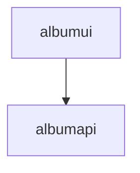

# Azure Container Apps Album Viewer UI

This is the companion repository for the [Azure Container Apps code-to-cloud quickstart]() Album Viewer UI.

The Album API sample is available in other languages:

| [C#](https://github.com/azure-samples/containerapps-albumapi-csharp) | [Go](https://github.com/azure-samples/containerapps-albumapi-go) | [Python](https://github.com/azure-samples/containerapps-albumapi-python) | [JavaScript](https://github.com/azure-samples/containerapps-albumapi-javascript) |
| -------------------------------------------------------------------- | ---------------------------------------------------------------- | ------------------------------------------------------------------------ | -------------------------------------------------------------------------------- |

##
|アプリ|リポジトリ|
|--|--|
|UIアプリ|https://github.com/akubicharm/containerapps-albumui|
|APIアプリ|https://github.com/akubicharm/https://github.com/akubicharm/containerapps-albumapi-javascript|
|マニフェストファイル|https://github.com/akubicharm/containerapps-albumui-manifest|

## 実行時の設定

albumui アプリはデフォルトで8080ポート、alubumapi アプリはデフォルトで8080ポートでリッスンする。

albumui からバックエンドの呼び出しは、`${API_BASE_URL}/albums` となるので、albumapi のURLを環境変数または`.env` ファイルで`API_BASE_URL` を設定してから起動する。

